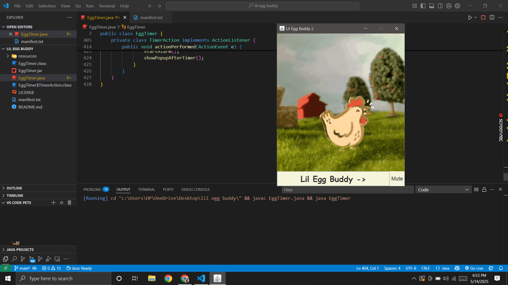
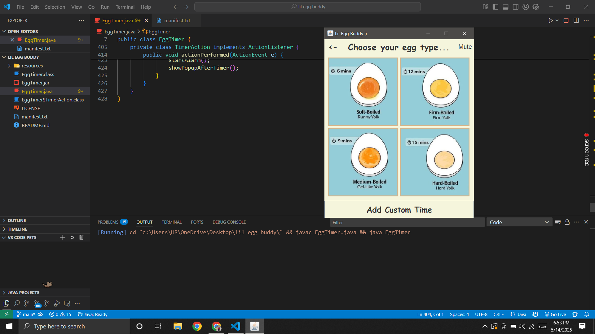
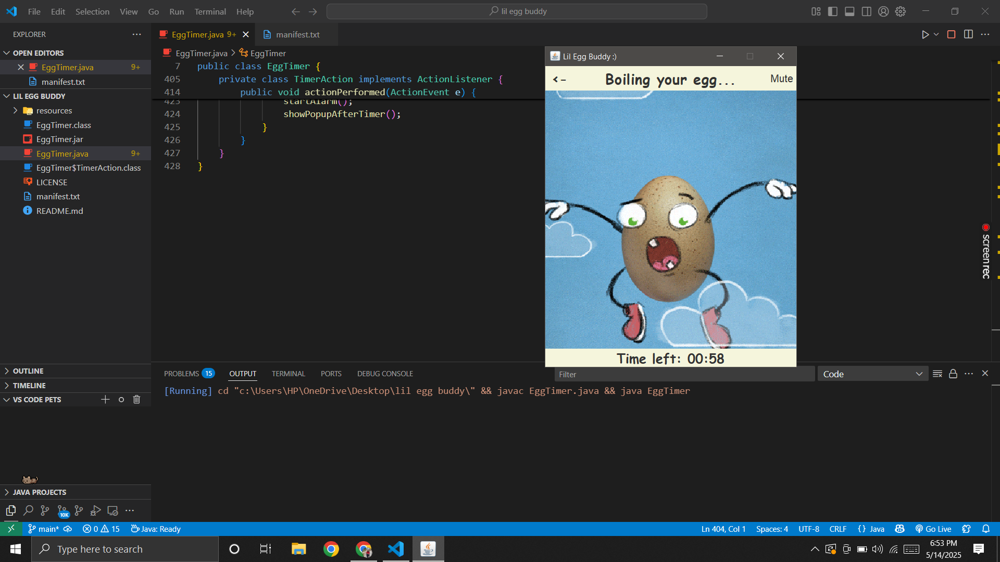
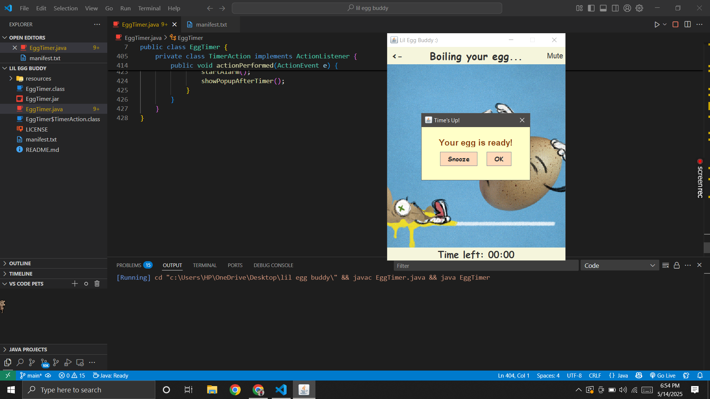

# 🥚 Lil Egg Buddy

**Lil Egg Buddy** is a fun, interactive desktop timer app that helps you boil your eggs *just right*! Whether you like them soft, medium, hard, or want to set a custom time, this buddy has got your back!

## 📸 Screenshots

### 🐣 Welcome Screen  


### ⏳ Timer Running  


### 🚨 Alarm Popup  


### 🚨 Alarm Popup  

## 🎯 Features

- ⏲️ Preset timers: Soft, Medium, Hard, and Firm boiled eggs
- 🎛️ Custom timer option
- 🎵 Fun sounds for boiling, clicking, and alarms
- 🎞️ Animated GIFs for a lively user experience
- 📸 Egg images for different boiling types
- 📦 Simple `.jar` file to run anywhere with Java installed

## 🖥️ Technologies Used

- Java Swing for GUI
- Java Timer for countdown functionality
- AudioClips for sound effects
- ImageIcons and Labels for visual representation

## 🚀 How to Run

1. Make sure Java is installed on your system.
2. Download the `EggTimer.jar` file.
3. Open terminal or command prompt.
4. Navigate to the folder containing the `.jar` file.
5. Run the app with:

   ```bash
   java -jar EggTimer.jar
# 🥚 Lil Egg Buddy

**Lil Egg Buddy** is a fun, interactive desktop timer app that helps you boil your eggs *just right*! Whether you like them soft, medium, hard, or want to set a custom time, this buddy has got your back!

## 🎯 Features

- ⏲️ Preset timers: Soft, Medium, Hard, and Firm boiled eggs
- 🎛️ Custom timer option
- 🎵 Fun sounds for boiling, clicking, and alarms
- 🎞️ Animated GIFs for a lively user experience
- 📸 Egg images for different boiling types
- 📦 Simple `.jar` file to run anywhere with Java installed

## 🖥️ Technologies Used

- Java Swing for GUI
- Java Timer for countdown functionality
- AudioClips for sound effects
- ImageIcons and Labels for visual representation

## 🚀 How to Run

1. Make sure Java is installed on your system.
2. Download the `EggTimer.jar` file.
3. Open terminal or command prompt.
4. Navigate to the folder containing the `.jar` file.
5. Run the app with:

   ```bash
   java -jar EggTimer.jar
# 🥚 Lil Egg Buddy

**Lil Egg Buddy** is a fun, interactive desktop timer app that helps you boil your eggs *just right*! Whether you like them soft, medium, hard, or want to set a custom time, this buddy has got your back!

## 🎯 Features

- ⏲️ Preset timers: Soft, Medium, Hard, and Firm boiled eggs
- 🎛️ Custom timer option
- 🎵 Fun sounds for boiling, clicking, and alarms
- 🎞️ Animated GIFs for a lively user experience
- 📸 Egg images for different boiling types
- 📦 Simple `.jar` file to run anywhere with Java installed

## 🖥️ Technologies Used

- Java Swing for GUI
- Java Timer for countdown functionality
- AudioClips for sound effects
- ImageIcons and Labels for visual representation

## 🚀 How to Run

1. Make sure Java is installed on your system.
2. Download the `EggTimer.jar` file.
3. Open terminal or command prompt.
4. Navigate to the folder containing the `.jar` file.
5. Run the app with:

   ```bash
   java -jar EggTimer.jar

## 📁Project Structure
lil-egg-buddy/
│
├── EggTimer.java               # Main Java source file
├── EggTimer.class              # Compiled class
├── EggTimer$TimerAction.class # Timer action inner class
├── EggTimer.jar                # Executable JAR file
├── manifest.txt                # Manifest file for JAR
├── resources/                  # All images and sounds
│   ├── alarm.wav
│   ├── boiling.gif
│   ├── calm.wav
│   ├── click.wav
│   ├── egg.gif
│   └── images/
│       ├── soft_boiled.jpg
│       ├── medium_boiled.jpg
│       ├── hard_boiled.jpg
│       ├── firm_boiled.jpg
│       └── custom.jpg

## 💡 Inspiration
This app was built to make the boring wait for a boiled egg more fun and interactive. Also perfect for teaching beginners how timers and media can be used in Java desktop applications!

## 🙋‍♀️ Created by
Aastha Bhatia
Connect with me on LinkedIn: https://www.linkedin.com/in/aasthabhatia-er/
GitHub: Aastha-Bhatia
